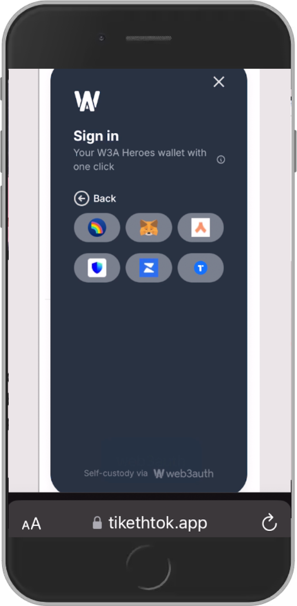
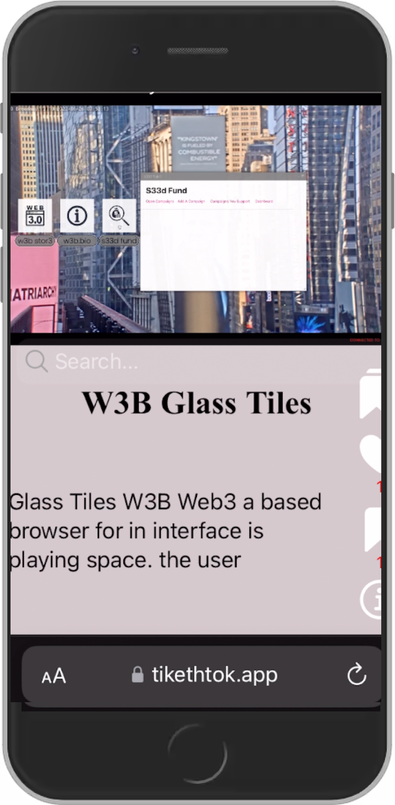
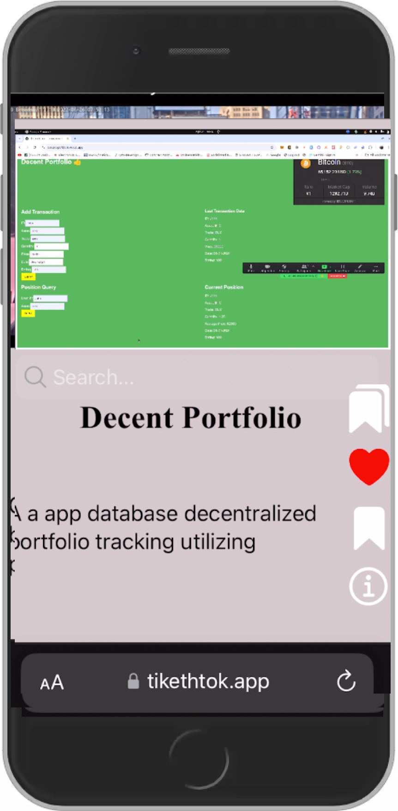
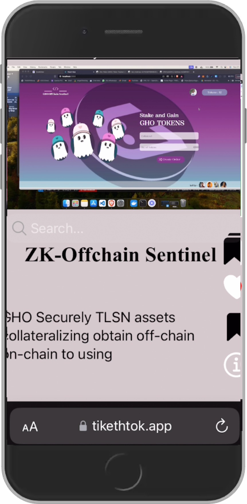

<h1 align="center">

     
    Tik-Eth-Tok
</h1>

> Note: TikEthTok was tested using the MetaMask mobile wallet on Android and iOS devices.  Other wallets may malfunction, or not work at all.

## Preview

 
 
 
 
 
 

## Running the application locally

To run the application, you must first follow the steps below

* Download **python3**, **nodeJS**, **npm** and **docker** including **docker-compose **cli.

* Download ionic cli.
 ~~~
npm install -g @ionic/cli
 ~~~

* Download the project from this repository.
* Go to the download location of the project.

 ~~~
cd vendor/github.com/eaabak/ionTok
 ~~~

* Install node packages

~~~ 
npm install 
~~~

* Run this command to run the front end locally
~~~
ionic serve --external
~~~

Start the web3auth server

* Open a new **terminal**, and go to the download location of the project.

 ~~~
cd web3auth
 ~~~

* Run these commands to run the web3auth server.

~~~
npm install
npm run start
# or
cd w3a-example
yarn
yarn start
~~~

OPTIONAL: Start the database and backend server

* NOTE:  running the database and server requires SSL certificates. You will need docker, docker-compose, python3 and python venv installed. Open a new **terminal**, and go to the download location of the project.

 ~~~
./setup.sh
 ~~~

* Run these commands to run the database and backend server.

~~~
source ./showcase/bin/activate
cd server
docker-compose up -d
python3 server.py
~~~
